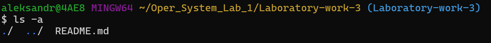
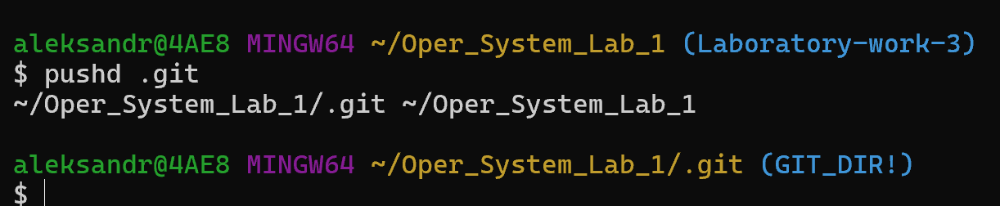
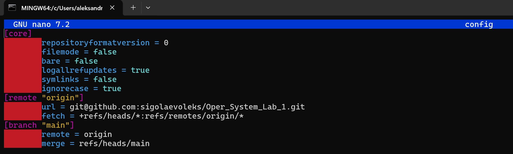
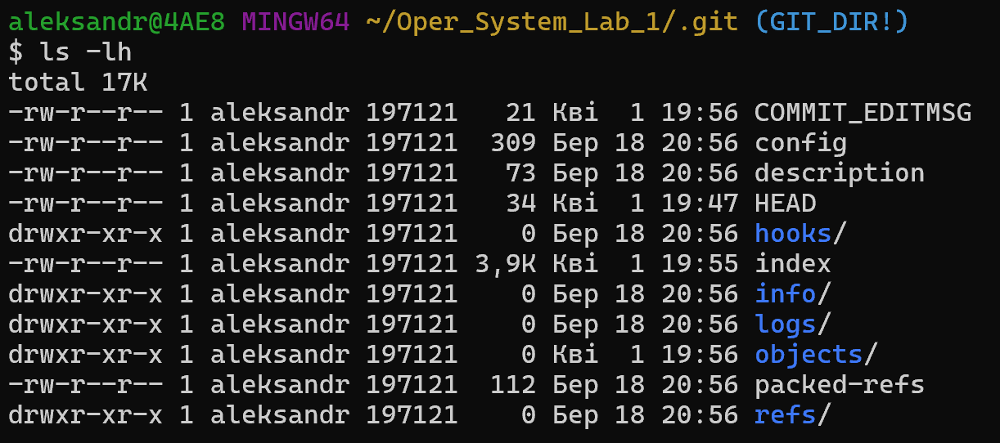
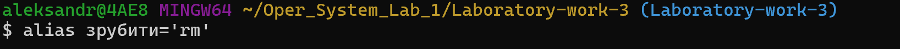
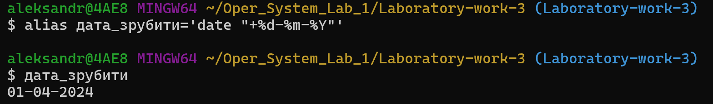
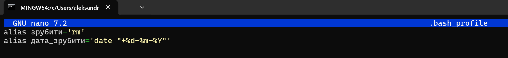
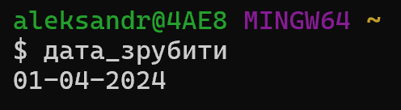
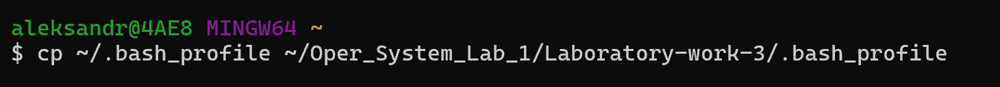

## Проста обробка текстових даних засобами оболонки Unix-подібних ОС інтерпретора команд ОС

### 1 Навігація по файловій системі через засоби оболонки Git Bash інтерпретатору командного рядку Bash

 
Рис. 1 – Скріншот результатів команди 2.2.1

Рис. 2 – Скріншот результатів команди 2.2.2

Рис. 3 – Скріншот результатів команди 2.2.3

Рис. 4 – Скріншот результатів команди 2.2.4

### 2 Налаштування псевдонімів команд оболонки Bash

 
Рис. 1 – Скріншот результатів команди 2.3.1

Рис. 2 – Скріншот результатів команди 2.3.2

Рис. 3 – Скріншот результатів команди 2.3.3

Рис. 5 – Скріншот результатів команди 2.3.5

Рис. 6 – Скріншот результатів команди 2.3.6
