## Складна обробка текстових даних засобами оболонки Unix-подібних ОС інтерпретора команд ОС

 
### 1 Пошук у системних файлах Git-репозиторію

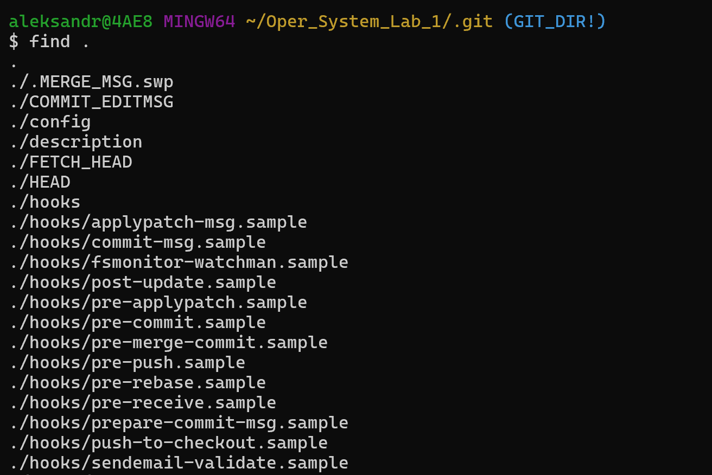 
Рис. 1 – Скріншот результатів команди 2.1.1

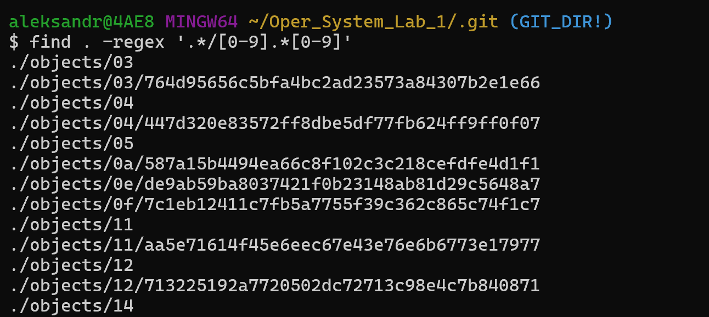
Рис. 2 – Скріншот результатів команди 2.1.2

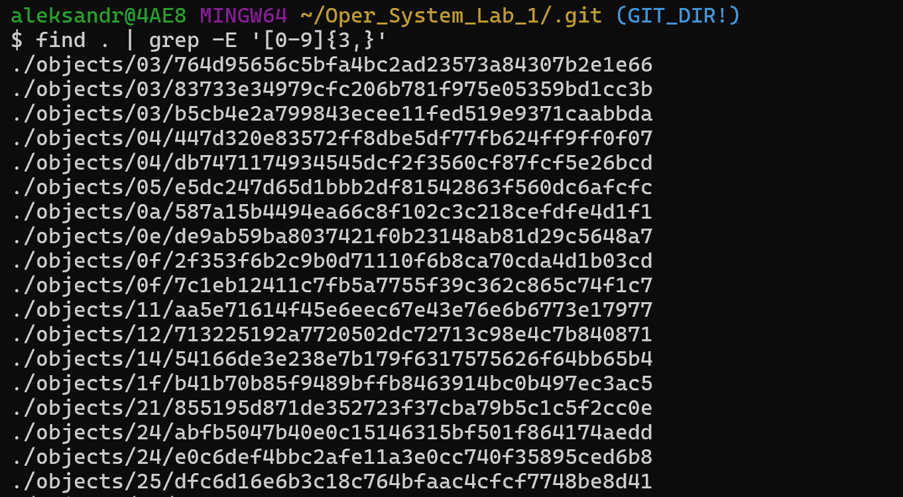
Рис. 3 – Скріншот результатів команди 2.1.3

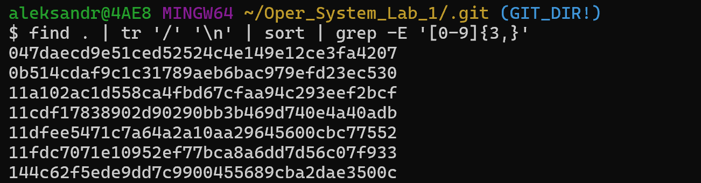
Рис. 4 – Скріншот результатів команди 2.1.4

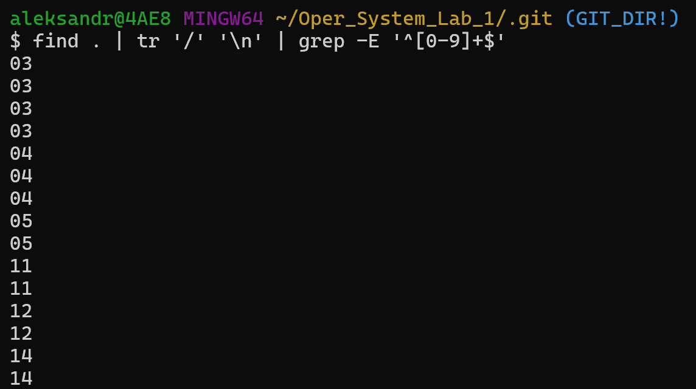
Рис. 4 – Скріншот результатів команди 2.1.5

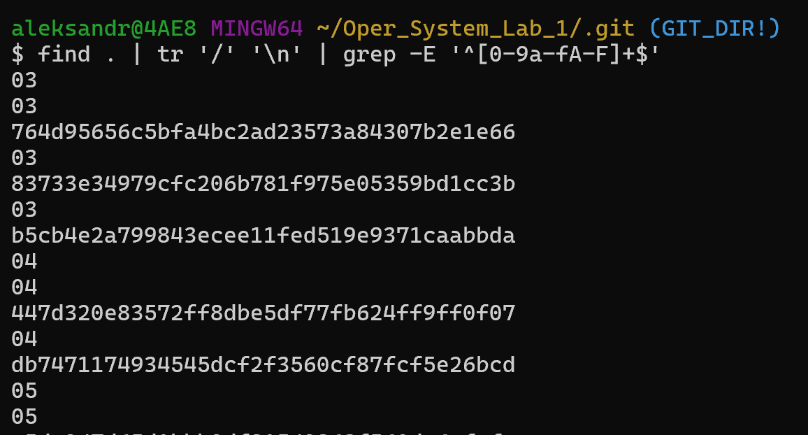
Рис. 4 – Скріншот результатів команди 2.1.6

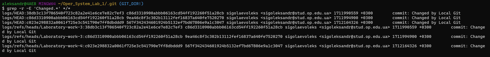
Рис. 4 – Скріншот результатів команди 2.1.7

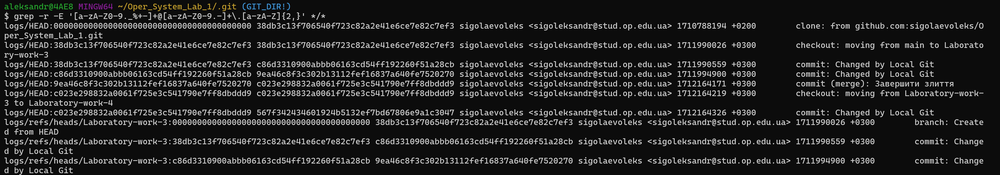
Рис. 4 – Скріншот результатів команди 2.1.8

### 2 Складний пошук та заміна текстових даних

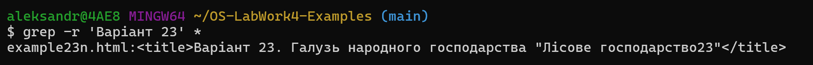 
Рис. 1 – Скріншот результатів команди 2.2.1

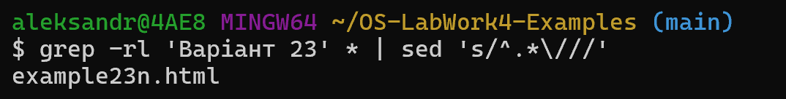
Рис. 2 – Скріншот результатів команди 2.2.2

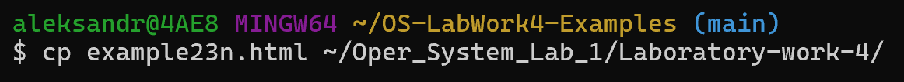
Рис. 3 – Скріншот результатів команди 2.2.3

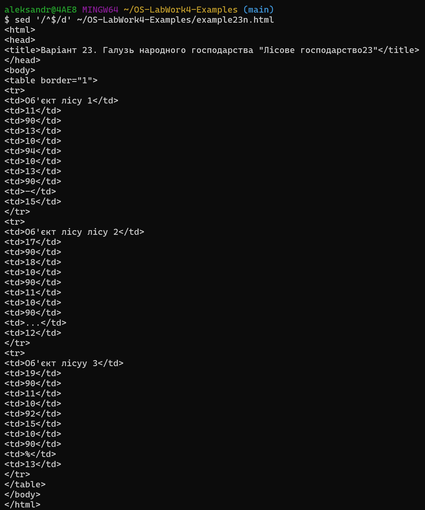
Рис. 4 – Скріншот результатів команди 2.2.4

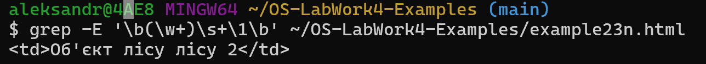
Рис. 4 – Скріншот результатів команди 2.2.5

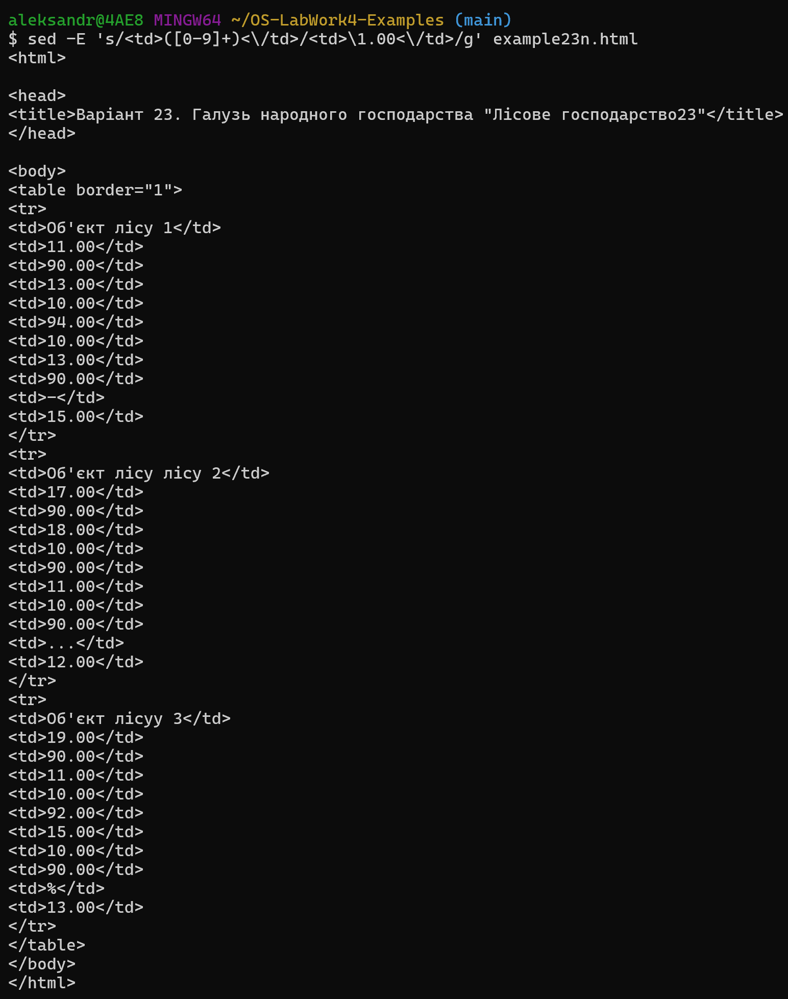
Рис. 4 – Скріншот результатів команди 2.2.6

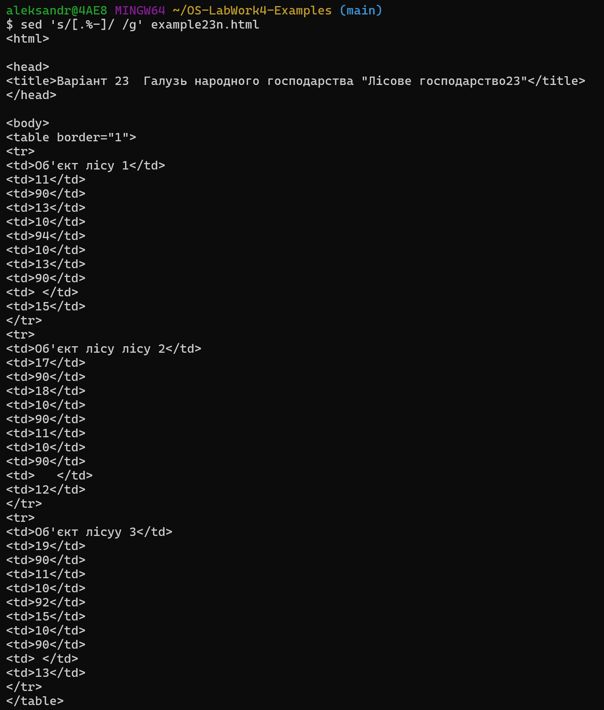
Рис. 4 – Скріншот результатів команди 2.2.7

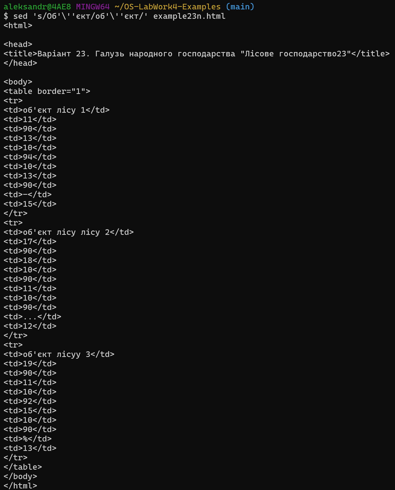
Рис. 4 – Скріншот результатів команди 2.2.8

### 3 Автоматизована модифікація файлів з текстовими даними

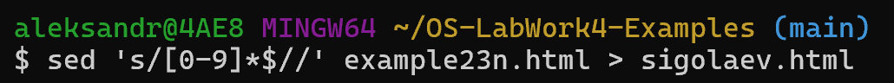 
Рис. 1 – Скріншот результатів команди 2.3.1

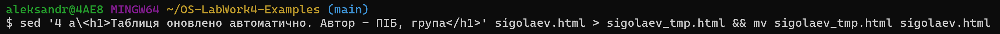
Рис. 2 – Скріншот результатів команди 2.3.2

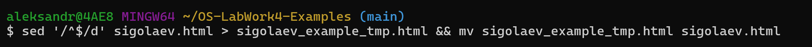
Рис. 3 – Скріншот результатів команди 2.3.3

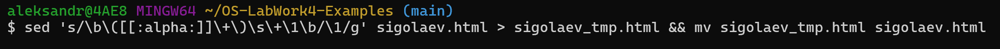
Рис. 4 – Скріншот результатів команди 2.3.4

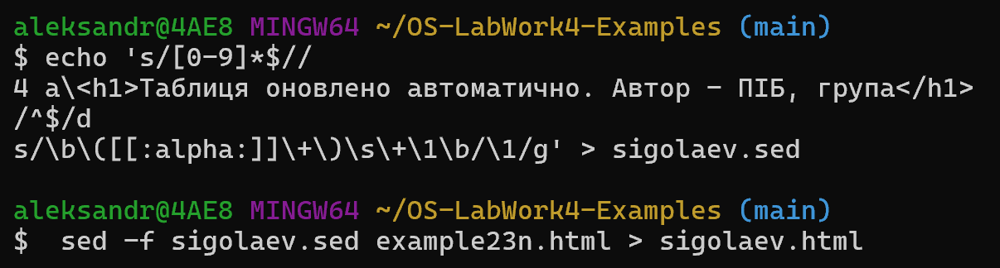
Рис. 4 – Скріншот результатів команди 2.3.5
